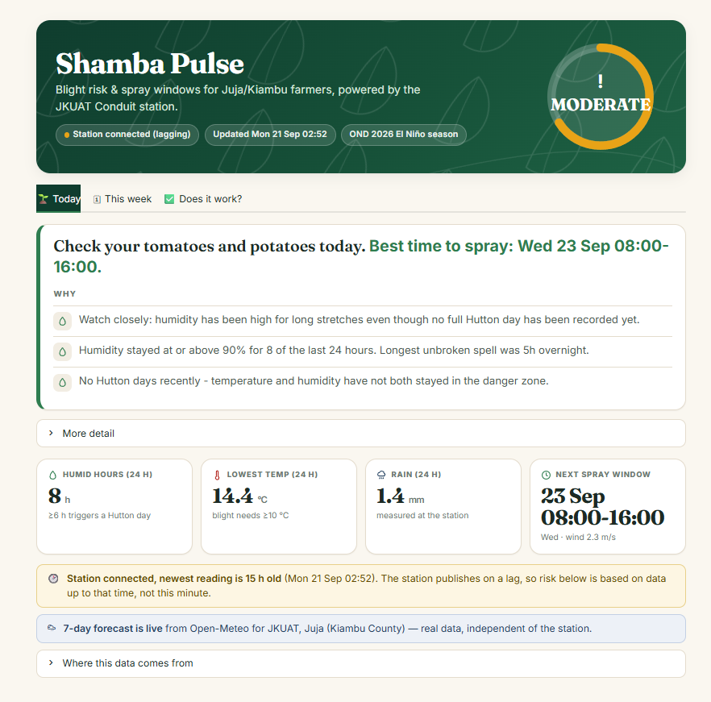
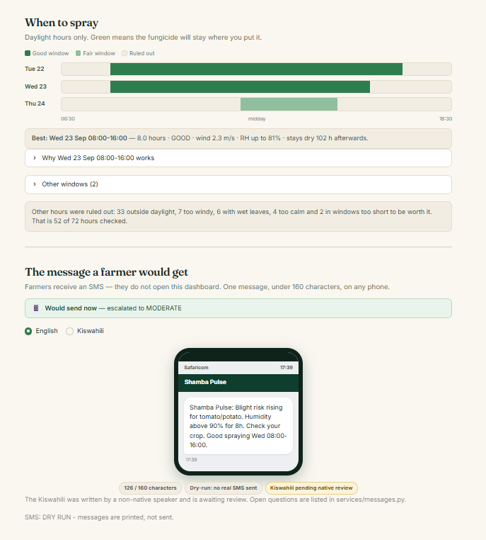
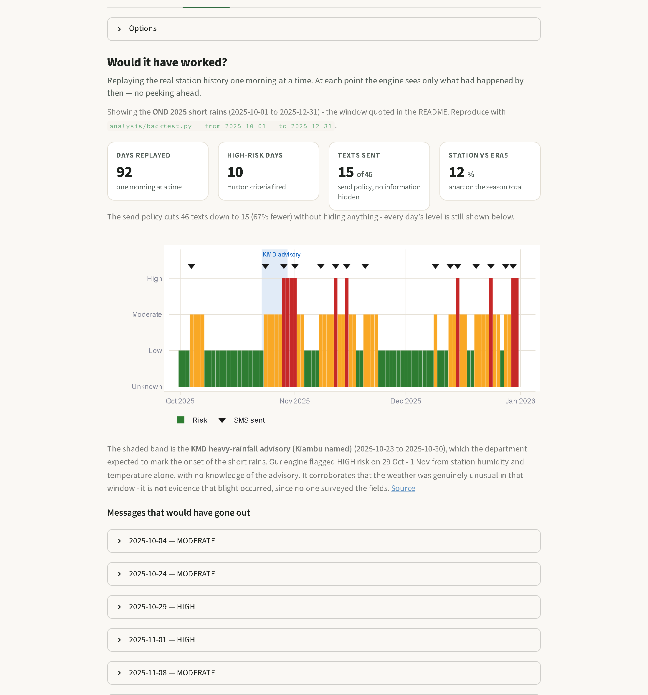
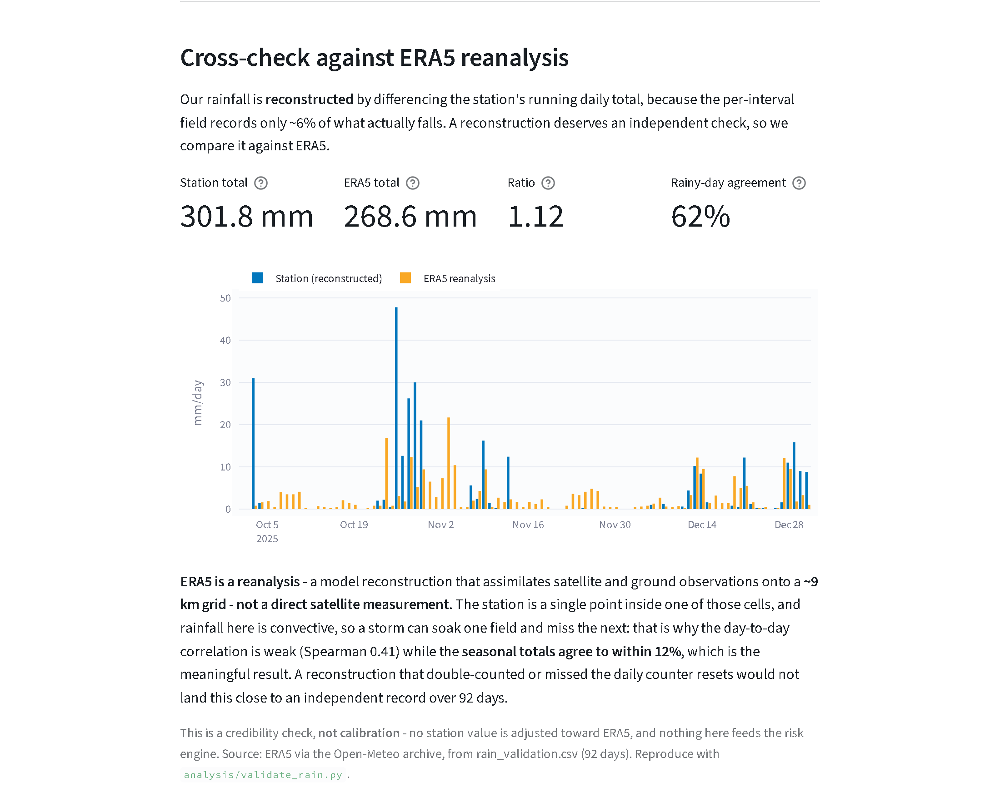

# 🌱 Shamba Pulse

**Late-blight warnings and spray timing for smallholder tomato and potato
farmers around Juja, Kiambu — built on real data from the JKUAT Conduit weather
station.**

Hack The Weather 2026 · JHUB Africa / JKUAT

[](https://shamba-pulse-jkuat.streamlit.app/)

**▶ [Open the live app](https://shamba-pulse-jkuat.streamlit.app/)** · **[Source on GitHub](https://github.com/Hackathons-4thyear/HackTheWeather)**

---

## In 30 seconds

- **What:** turns the JKUAT Conduit station's readings into two decisions —
  *is my crop at risk of late blight*, and *when should I spray*.
- **How:** the Hutton criteria on station humidity and temperature, plus a
  spray-window finder over the Open-Meteo forecast. Rule-based, every threshold
  explained in one file.
- **Output:** an SMS under 160 characters in **English and Kiswahili**, sent
  only when the risk actually changes.
- **Evidence:** replayed against the **real OND 2025 short rains** — 92 days,
  10 HIGH-risk days, 15 messages, no lookahead.
- **Honesty:** we found three faults in the station data that would each have
  produced confidently wrong advice, and we publish them.
- **The dashboard** puts the verdict first: a risk ring, the action to take, the
  week ahead, a daylight spray timeline, the SMS on a phone, and the station on
  a map.

```bash
.venv/Scripts/streamlit run app.py     # works with no API key - see Running it
```

---



*The verdict first: a risk ring that states the level in words as well as
colour, one imperative sentence naming the actual spray window, and the reasons
behind it. The "lagging" pill is the app reporting that the station's newest
reading is hours old rather than calling stale data "live".*



*Spray windows drawn across each day's daylight hours, with a plain sentence
saying what was ruled out and why &mdash; then the exact SMS a farmer receives,
shown on a phone, switchable between English and Kiswahili.*



*Every day of the OND 2025 short rains replayed, under the headline numbers.
Red is HIGH risk, triangles are messages that would have been sent, and the
shaded band is the KMD heavy-rainfall advisory.*



*Our reconstructed rainfall against ERA5 for the same season. Seasonal totals
agree to within 12%; the weak day-to-day correlation is expected, not a defect.*

---

## It works on real data

We replayed the **October–December 2025 short rains** through the engine, one
morning at a time, with the engine seeing only what had happened by that point.
No lookahead, no hand-picked demo day.

**92 days of real station readings. 8,737 observations. 98.6–99.1% coverage.**

| Result | |
|---|---|
| Days at **HIGH** blight risk | **10** |
| Longest Hutton run | **5 consecutive days** |
| Days inside a Hutton run | 21 |
| SMS actually sent under the send policy | **15** |
| SMS if we texted every eligible day | 46 |
| Days we refused to judge (data gaps) | 0 |

The season's main event:

> **29 October – 1 November 2025** — four straight days at HIGH risk, on a
> five-day Hutton run.

The window is the calendar season, exactly October–December. The final HIGH
episode begins 30 December and **continued into January 2026**; only its two
December days are counted here, because extending the window to capture the
rest of an episode would be choosing the boundary to suit the result.

### Independent corroboration

That window **coincided with** the Kenya Meteorological Department's
[heavy-rainfall advisory for 23–30 October 2025][kmd], which named Kiambu among
the affected counties and expected it to mark the onset of the short rains.

Our engine flagged that period from station humidity and temperature alone,
with no knowledge of the advisory.

**What this shows and does not show.** It corroborates that the weather in that
window was genuinely unusual, and that the engine reacted to it rather than to
noise. It is **not** evidence that blight actually occurred — nobody surveyed
the fields. Validating against observed outbreaks is the single most valuable
thing we could do next.

[kmd]: https://allafrica.com/stories/202510230054.html

Reproduce it exactly:

```bash
.venv/Scripts/python.exe analysis/backtest.py --from 2025-10-01 --to 2025-12-31
```

(Running `analysis/backtest.py` with no arguments replays the **full 476-day**
history instead, which is a different and larger result: 475 days, 79 HIGH
days, 61 messages.)

---

## Running it

**Requires Python 3.11+** (developed on 3.13).

```bash
git clone https://github.com/Hackathons-4thyear/HackTheWeather.git
cd HackTheWeather

python -m venv .venv
.venv\Scripts\python.exe -m pip install -r requirements.txt   # Windows
# source .venv/bin/activate && pip install -r requirements.txt  # macOS/Linux

.venv\Scripts\streamlit run app.py
```

Opens `http://localhost:8501`. **It runs without credentials** — it falls back
to the committed 476-day station history and says so in the banner.

For live station data, copy `.env.example` to `.env` and fill in
`CONDUIT_API_KEY` and `CONDUIT_EMAIL`. Deploying to Streamlit Community Cloud:
[docs/DEPLOYMENT.md](docs/DEPLOYMENT.md).

<details>
<summary><strong>Everything else you can run</strong></summary>

```bash
# Confirm the live API and print the raw response
.venv/Scripts/python.exe analysis/test_conduit_live.py

# Inspect whatever is in data/
.venv/Scripts/python.exe analysis/explore_data.py data/conduit_history.parquet

# Download history (cached, 1s spacing, resumable)
.venv/Scripts/python.exe analysis/fetch_history.py

# Replay the canonical season
.venv/Scripts/python.exe analysis/backtest.py --from 2025-10-01 --to 2025-12-31

# Cross-check our rainfall against ERA5
.venv/Scripts/python.exe analysis/validate_rain.py

# 287 tests
.venv/Scripts/python.exe -m pip install -r requirements-dev.txt
.venv/Scripts/python.exe -m pytest tests/ -q
```

SMS defaults to **dry run** — messages print, nothing is sent. Set
`SMS_DRY_RUN=false` with `AT_USERNAME=sandbox` to use the Africa's Talking
sandbox.

</details>

---

## The problem

Late blight (*Phytophthora infestans*) can destroy a tomato or potato crop in
under a week. The wet, humid spells of an El Niño short-rains season are exactly
when it spreads — and exactly when a farmer can least afford to guess.

Two guesses cost money:

1. **Spraying on a fixed schedule.** Fungicide applied in the wrong week is
   wasted; applied too late it is useless.
2. **Spraying at the wrong moment.** Rain within a few hours washes it off.
   Dew-covered leaves dilute it. Still air lets it drift; strong wind blows it
   away.

A weather station up the road already measures everything needed to answer
both. Nobody was turning those numbers into a decision.

## The solution

```
JKUAT Conduit station  ─┐
(15-min observations)   ├─►  Hutton criteria      ─►  risk + plain-language
Open-Meteo forecast    ─┘    + spray-window rules     reasons
                                                          │
                                        ┌─────────────────┴─────────────────┐
                                        ▼                                   ▼
                              SMS in English and              Streamlit dashboard
                              Kiswahili, under 160                (this repo)
                              characters, send-policy
                              gated
```

### Who it is for

**Two different users, two different products.**

**The farmer's product is the SMS.** A smallholder does not open a dashboard
during planting season. They get one message, under 160 characters, in English
or Kiswahili, on any phone — and only when the risk has actually changed.

**The dashboard is for the people who advise many farmers**: county extension
officers, agrovet and agro-dealer staff, and cooperative field teams. They need
the reasoning, the forecast, the spray windows and the evidence trail so they
can answer *why* — and one of them serves hundreds of farms, which is what
makes a single weather station worth building on.

**Who would pay.** The realistic routes are county extension services, farmer
cooperatives, and input suppliers bundling alerts with what they already sell.
We have not negotiated with any of them and quote no prices. What we can say is
that the send policy makes the unit economics plausible at all: **15 messages
per farmer per season, not one every morning.**

### Data → Insight → Action → Impact

**Data.** Every 15 minutes the Conduit station records temperature, humidity,
pressure, wind, rainfall and light. We pull it through a defensive client and
map it onto canonical columns. Open-Meteo supplies a 7-day hourly forecast for
the same coordinates, free and without a key.

**Insight.** Humidity and temperature go into the **Hutton criteria**, the
operational standard for late-blight warning. Forecast rain, wind, humidity and
daylight go into the **spray-window finder**. Every output carries its reasons.

**Action.** A farmer gets an SMS under 160 characters, in English or Kiswahili,
telling them the risk and when to spray. Not a weather report — a decision.

> Shamba Pulse: HIGH blight risk for tomato/potato. Humidity stayed above 90%
> for 11h, 2 days running. Spray Wed 09:00-17:00 if you can.

> Shamba Pulse: HATARI KUBWA ya baka chelewa, nyanya/viazi. Unyevu juu ya 90%
> masaa 11, siku 2. Nyunyiza Jumatano saa 3 asubuhi-saa 11 jioni.

**Impact.** See below — stated as a scenario, not a measurement.

---

## Impact: an illustrative scenario

> ⚠️ **This is a worked scenario, not a measured result.** We have not run a
> field trial. No yield or money figures appear here because we have not earned
> the right to quote any.

Over the 92 days of OND 2025, a **weekly fixed spray schedule** is about
**13 applications**.

Our backtest found **10 HIGH-risk days**, clustered into **six episodes**, two
of which ran for multiple days:

| Episode | Days |
|---|---|
| 29 Oct – 1 Nov | 4 |
| 12 Nov | 1 |
| 15 Nov | 1 |
| 15 Dec | 1 |
| 24 Dec | 1 |
| 30 Dec – 31 Dec | 2 (continued into January 2026) |

Spraying in response to those episodes — **one application per episode, six in
total** — targets protection at the periods when the criteria say infection
conditions were actually met.

**Stated plainly: 13 scheduled applications versus 6 targeted ones.**

**The assumptions this rests on**, all of which need testing:

- That one application covers an episode, which depends on the product's
  persistence and whether rain fell after it.
- That the periods *between* episodes genuinely carried low enough risk to skip
  — the Hutton criteria say so, but a UK-derived model says so.
- That a farmer can act on the day an alert arrives.
- That fewer, better-timed sprays protect the crop at least as well. **This is
  the claim a field trial would have to establish, and we have not.**

What the backtest *does* establish is narrower and solid: on 92 days of real
station data, the engine identified 10 high-risk days and would have sent 15
messages — not 92, and not zero.

---

## Data quality: what we found when we looked

We did not trust the obvious field names. Three of these would have produced
confidently wrong advice.

| Finding | Impact if trusted |
|---|---|
| **`rg1` captures 6.2% of rainfall** — 18.6 mm recorded vs 301.8 mm actual over OND 2025 | Spray adviser would think it never rains, and recommend spraying into a storm |
| **Rain gauge 2 is faulty** — daily total resets ~21×/day instead of once; reconstructs to 4,365 mm in a ~300 mm season | We had been using it to fill gaps in gauge 1 |
| **Timestamps are UTC, not local** (Kenya is UTC+3) | A silent 3-hour shift in every overnight humid-hours count, and a moved daily boundary |
| **`wind_gust_dir` duplicates `wind_gust`** — identical on 100% of rows, range −999.9 to 13.9 | It is not a direction at all |
| **`si1145_uv` reads constant zero** | A dead channel |

Rainfall is therefore derived by differencing the running daily total `rg1tt`.
Cross-checked against ERA5 reanalysis for the same coordinates: **301.8 mm vs
268.6 mm over OND 2025 — within 12%**. Daily correlation is modest
(Spearman 0.41), which is the physically expected result for a point gauge
against a ~9 km grid cell in convective rainfall, not a defect. It is a
credibility check, **not** calibration — no station value is adjusted toward
ERA5.

The dashboard carries this as a **"Cross-check against ERA5 reanalysis"**
panel in the *Does it work?* tab: the daily comparison, the season totals
and the rainy-day agreement, with the same caveat stated in full. ERA5 is a **reanalysis** — a model reconstruction that assimilates satellite and ground observations onto a ~9 km grid, **not a direct satellite measurement**.
The station is a single point inside one of those cells and rainfall here
is convective, which is why the day-to-day correlation is weak while the
**seasonal agreement is the meaningful result**. No station value is
adjusted toward ERA5.

**Full evidence and reproduction commands: [docs/DATA_QUALITY.md](docs/DATA_QUALITY.md)**

---

## Methodology

### Late-blight risk — the Hutton criteria

A **Hutton day** requires **both**:

- daily minimum temperature **≥ 10 °C**, and
- **≥ 6 hours** at relative humidity **≥ 90%**.

**Two consecutive Hutton days = HIGH risk.** This is the operational standard
used by the James Hutton Institute, successor to the Smith Period.

**HIGH is reserved for that trigger and nothing else.** If Shamba Pulse says
HIGH, the Hutton criteria fired.

A secondary **humid-hours** measure grades the last 24 hours LOW / MODERATE /
HIGH so there is always an answer — mid-day, or when the record has gaps. It
can lift LOW to MODERATE when humidity has been sitting high without a completed
Hutton day, but it can **never** produce HIGH on its own.

### Honesty about gaps

- A day missing **>25%** of its hours is marked *insufficient data* and is not
  judged. It **breaks** a consecutive-Hutton run rather than being bridged — a
  missing night is exactly when the humid hours would have happened.
- Coverage is treated **asymmetrically**: observing 6 humid hours *proves* at
  least 6 occurred however many were missed, so a positive stands. Observing
  zero in 8 of 24 proves nothing about the other 16 — so LOW, the only verdict
  telling a farmer to relax, requires real coverage and otherwise returns
  UNKNOWN.
- An hour with no readings resamples to `NaN`, never to a confident 0 mm.

### Spray windows

An hour is sprayable when **all** hold:

| Rule | Threshold | Why |
|---|---|---|
| Not raining now | ≤ 0.2 mm | Below a tipping-bucket's resolution is noise |
| Dry afterwards | **6 h** | Contact fungicide needs ~4–6 h to become rain-fast |
| Wind in band | **1–4 m/s** | Below 1: droplets hang and drift. Above 4: blown off target |
| Leaves dry | RH **< 90%** | Dew dilutes the spray and causes runoff |
| Daylight | **06:30–18:30** | Nobody sprays at 3am. Day length barely moves at this latitude |
| Long enough | **≥ 2 h** | After clipping — not worth mixing a tank for less |

Windows are **clipped** to daylight rather than discarded, so an overnight dry
spell still yields its morning tail. **Only the spraying is daylight-limited** —
the 6-hour dry requirement looks through the night, because rain at 2am still
washes off a 7pm spray.

Every threshold lives in [`config.py`](config.py) with a comment explaining the
number.

### Alert policy — what gets texted

The dashboard shows every day's level. The SMS policy decides what is worth a
farmer's attention:

- **LOW / UNKNOWN** — never text. No action to take.
- **HIGH** — always eligible. An escalation *into* HIGH ignores the cooldown
  entirely.
- **MODERATE** — only on escalation from LOW/UNKNOWN, never while it persists.
- **Cooldown** — 3 days between texts at the same level.

On real OND 2025 data this cut **46 eligible days to 15 texts (67% fewer)**
without hiding anything.

---

## Limitations

We would rather state these than have a judge find them.

**One station.** Every reading comes from a single point at JKUAT. Humidity and
rainfall vary sharply over a few kilometres in convective weather. A farm 10 km
away may experience a different night.

**No soil-moisture sensor. No leaf-wetness sensor.** Neither exists on this
station and we never fabricate them. Relative humidity ≥ 90% is our
leaf-wetness proxy — which is what the Hutton criteria are defined on, but it
is a proxy.

**The Hutton criteria were developed in the UK.** They encode a temperate
understanding of *P. infestans*. Kenyan highland conditions, local pathogen
strains and local cultivars may shift the thresholds. **Local calibration
against observed blight outbreaks in Kiambu is the single most important next
step** — until then, the thresholds are borrowed, not validated here.

We use Hutton anyway because it is the established operational standard and it
is *transparent*: every threshold is one line in `config.py`, so a local
agronomist can disagree with a number and change it, which is not true of a
model fitted to data we do not have.

**Backtest spray windows use perfect foresight.** No archive exists of what the
forecast *said* on a past day, only what the weather *did*. So spray windows in
the backtest are computed from subsequent observed weather and are labelled
PERFECT-FORESIGHT everywhere. They show the ideal advice, not what the app
would have said. **Disease alerts carry no such caveat** — they use past
observations only, exactly as they would live.

**No field validation.** The engine has never been checked against an observed
outbreak. The KMD advisory corroborates the weather, not the disease.

What the backtest *does* establish is narrower: on 92 days of real station data
the engine fired on a defensible, reproducible schedule — 10 HIGH days, not 92
and not zero — without lookahead, which is enforced in code and asserted by
tests. That demonstrates the engine behaves correctly. It does not demonstrate
that blight occurred.

**No farmer interviews.** Every decision about the farmer experience — the
160-character limit, Kiswahili, Swahili time, sending only on escalation — is
reasoned from constraints rather than tested with users. Sitting with ten
farmers in Juja is the first thing we would do with more time.

**The Kiswahili is unreviewed.** Written by a non-native speaker. The dashboard
badges it as such, a test keeps the flag false until someone signs off, and
open questions are listed in [`services/messages.py`](services/messages.py) —
including whether *viazi* reads as Irish potato (the crop blight affects) or
sweet potato.

**One faulty sensor is worked around, not fixed.** Rain gauge 2 needs hardware
attention.

---

## What's next

1. **Farmer pilot with a county extension office.** Put the SMS in front of
   real smallholders through the people who already advise them, and watch what
   they do with it. Everything about the farmer experience is currently
   reasoned rather than tested.
2. **Calibrate against observed outbreaks in Kiambu.** Pair extension-officer
   or farmer-reported blight records with our risk history and tune the Hutton
   thresholds to local conditions, strains and cultivars.
3. **CHIRPS / GPM satellite rainfall in the live pipeline.** Today satellite
   data appears only as an offline ERA5 sanity check. Bringing gridded rainfall
   into the running system would fill station gaps, flag sensor drift
   automatically, and extend coverage beyond the single point we can currently
   speak for.
4. **Multi-station coverage.** One point cannot represent a county when a storm
   soaks one field and misses the next. More Conduit nodes, blended with
   satellite humidity, would let risk be interpolated across a farming area.
5. **An ML model trained on observed blight outbreaks.**
   `disease_engine.assess()` is a documented swap point — same input frame,
   same `RiskAssessment` out — so a learned model can replace the rules without
   touching a single caller. This needs labels first, which is why it follows
   calibration rather than leading.
6. **Native Kiswahili review**, then flip `SW_TRANSLATION_REVIEWED`. The
   specific open questions are already written down in
   [`services/messages.py`](services/messages.py).
7. **USSD.** SMS reaches any phone, but USSD would let a farmer *ask* rather
   than wait, with no smartphone and no data bundle.
8. **A soil-water model.** Rainfall plus evapotranspiration would add
   irrigation timing and waterlogging warnings — without ever pretending we
   measured soil moisture, because the station has no soil sensor.

---

## Project layout

```
app.py                      Streamlit dashboard
config.py                   Every threshold, each with a comment explaining it
data/
  conduit_history.parquet   476 days of real station data (committed)
  raw/                      per-chunk API cache (gitignored)
services/
  conduit_api.py            Station client - never raises
  data_processor.py         Raw -> canonical mapping, rainfall reconstruction
  data_source.py            live -> cached -> demo, always labelled
  forecast.py               Open-Meteo, same canonical columns
  disease_engine.py         Hutton criteria + humid-hours fallback
  spray_window.py           Spray-window finder
  messages.py               EN + SW templates (Kiswahili unreviewed)
  alerts.py                 Alert composition + send policy
  sms_sender.py             Africa's Talking: dry-run / sandbox / live
analysis/
  test_conduit_live.py      Probe the live API
  explore_data.py           Inspect any data file
  fetch_history.py          Bulk download, cached and resumable
  backtest.py               Replay history, no lookahead
  validate_rain.py          ERA5 cross-check
tests/                      282 tests
docs/DATA_QUALITY.md        Every data fault, with numbers
```

---

## Credits

Station data: **JKUAT Conduit weather station**, JHUB Africa.
Forecast and ERA5 reanalysis: **[Open-Meteo](https://open-meteo.com/)**.
Blight model: **Hutton criteria**, James Hutton Institute.
SMS: **Africa's Talking**.

Built for **Hack The Weather 2026**, JHUB Africa & JKUAT, Kenya.

**Weather station data belongs to JHUB Africa / JKUAT** and is used with the
access granted to hackathon participants. Open-Meteo forecast and ERA5
reanalysis are used under Open-Meteo's terms (CC-BY-4.0 for the data). The KMD
advisory is cited, not reproduced.

## License

This project's own code and documentation are released under the
[MIT License](LICENSE). That covers what we wrote; it does not grant rights
over the station data above.
